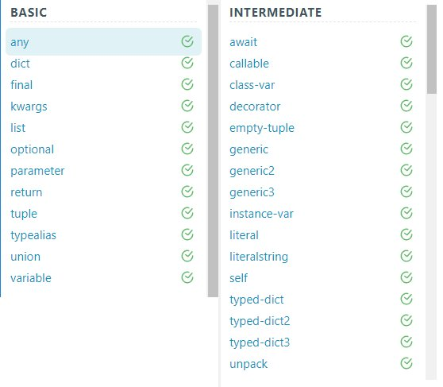

## Тренажер по аннотации типов
***
Цель:

пройти максимальное количество упраженений на аннотацию типов в
тренаржере https://python-type-challenges.zeabur.app
***
### Инструкция:
Настроить CI, который будет проверять аннотоции с помощью mypy или pyright, а
также обеспечить условия, при которых в локальном репозитории по команде make
typing  в контейнере запускалась бы аналогичная проверка типов.
***

Проверка типов - с помощью mypy.

Уровни: basic (basic.py), intermediate (intermediate.py).

Проверка локально: mypy basic.py intermediate.py

Проверка в контейнере: docker run --rm -v $(PWD)/homework_02 hw02_image mypy basic.py intermediate.py
